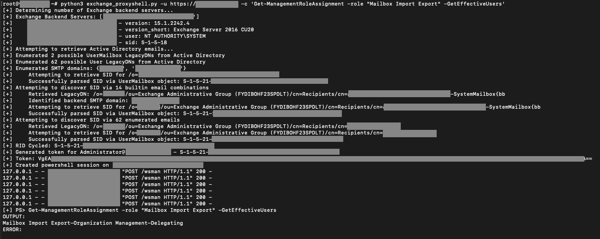

# ProxyShell
Proof of Concept Exploit for Microsoft Exchange CVE-2021-34473, CVE-2021-34523, CVE-2021-31207

# Details
For background information and context, read the [blog post](https://www.horizon3.ai/news/blog/proxyshell) detailing the research by Horizon3:
https://www.horizon3.ai/news/blog/proxyshell

## Features
* No email address needs to be supplied
* Attempts to enumerate emails from Active Directory
* Attempts to enumerate LegacyDNs from Active Directory
* Attempts to discover LegacyDNs from builtin emails
* Attempts to discover SID of Exchange server in load-balanced deployments
* Handles exploitation in load-balanced environments

# Usage
```bash
python3 exchange_proxyshell.py -u https://<IP>
```
### Example output


# Mitigations
Apply the security updates found here: 
https://msrc.microsoft.com/update-guide/vulnerability/CVE-2021-34473

# Prior Research Credit
- https://devco.re/blog/2021/08/22/a-new-attack-surface-on-MS-exchange-part-3-ProxyShell/
- https://www.zerodayinitiative.com/blog/2021/8/17/from-pwn2own-2021-a-new-attack-surface-on-microsoft-exchange-proxyshell
- https://peterjson.medium.com/reproducing-the-proxyshell-pwn2own-exploit-49743a4ea9a1
- https://github.com/dmaasland/proxyshell-poc

# Disclaimer
This software has been created purely for the purposes of academic research and for the development of effective defensive techniques, and is not intended to be used to attack systems except where explicitly authorized. Project maintainers are not responsible or liable for misuse of the software. Use responsibly.
